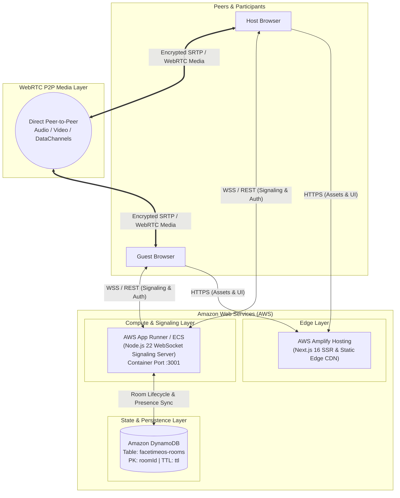

# FaceTimeOS 🚀

> **AWS Builder Hackathon Submission — "Ship it" Track**  
> A high-performance, real-time collaborative video conferencing operating system featuring WebRTC peer-to-peer audio/video streaming, persistent collaborative workspaces (code editor, canvas, shared notes), and a resilient, cloud-native AWS backend.

---

## 🏗️ AWS Cloud Architecture

FaceTimeOS leverages native AWS serverless and container services to provide a highly scalable, fault-tolerant, and low-latency collaborative platform. While WebRTC media streams (audio, video, and screen sharing) flow directly **peer-to-peer** between participants for maximum privacy and zero latency, meeting room lifecycle, session authorization, and presence state are coordinated through AWS infrastructure.

### Architecture Overview Diagram



### ASCII Architecture Diagram

```
+-------------------------------------------------------------------------------------------------+
|                                          USERS / PEERS                                          |
|         +---------------------------+                           +--------------------------+    |
|         |     Host Web Browser      |                           |     Guest Web Browser    |    |
|         +-------------+-------------+                           +------------+-------------+    |
+-----------------------|------------------------------------------------------|------------------+
                        |                                                      |
       HTTPS (UI/Pages) |                                     HTTPS (UI/Pages) |
                        v                                                      v
+-------------------------------------------------------------------------------------------------+
|                                       AWS AMPLIFY HOSTING                                       |
|                                (Next.js 16 Edge / CDN Distribution)                             |
|                                [Built automatically via amplify.yml]                            |
+-------------------------------------------------------------------------------------------------+
                        |                                                      |
    WSS / REST Signaling|                                  WSS / REST Signaling|
                        v                                                      v
+-------------------------------------------------------------------------------------------------+
|                                         AWS APP RUNNER                                          |
|                                (Signaling & Room Authority Container)                           |
|                             * Production Dockerfile on Node.js 22 Alpine                        |
|                             * Health Probe: GET /health (:3001)                                 |
|                             * JWT Session Tokens & WebRTC Negotiation                          |
+-------------------------------------------------------------------------------------------------+
                                                |
                              CRUD Room State & | Presence Tracking
                                                v
+-------------------------------------------------------------------------------------------------+
|                                        AMAZON DYNAMODB                                          |
|                                   (Table: facetimeos-rooms)                                     |
|                       * Partition Key: roomId (String)                                          |
|                       * Status, Host Info, Metadata, Participants Map                           |
|                       * Automatic 72-Hour Ephemeral Expiration via TTL                          |
|                       * Graceful In-Memory Fallback when AWS is Offline                         |
+-------------------------------------------------------------------------------------------------+

                      =====================================================
                      DIRECT PEER-TO-PEER WEBRTC MEDIA (Audio / Video / Data)
                      [Host Browser] <====== WebRTC P2P / SRTP ======> [Guest Browser]
                      =====================================================
```

---

## 🌟 Key AWS Architectural Decisions

1. **Frontend on AWS Amplify Hosting (`client/`)**:
   - Automated CI/CD edge deployment configured via [`amplify.yml`](amplify.yml).
   - Global CDN caching with Next.js App Router support for instant page loads.
   - Built-in HTTPS encryption satisfies strict WebRTC `getUserMedia` browser security requirements.

2. **Signaling Backend on AWS App Runner (`server/`)**:
   - Packaged as a production-grade, containerized service via [`server/Dockerfile`](server/Dockerfile).
   - Manages WebSocket (`socket.io`) connections with auto-scaling and seamless HTTPS/WSS termination.
   - Container health monitoring via `/health` endpoint with active uptime and service telemetry.

3. **Room Lifecycle on Amazon DynamoDB**:
   - Managed by the [`DynamoDBRoomManager`](server/src/dynamodb-room-manager.js) module using `@aws-sdk/client-dynamodb` and `@aws-sdk/lib-dynamodb`.
   - Single-digit millisecond latency for room lookups (`getRoom`), creation (`createRoom`), participant presence updates (`updateParticipantState`), and closure (`closeRoom`).
   - Native DynamoDB Time-to-Live (TTL) automatically purges idle rooms after 72 hours without requiring background cron tasks.
   - **Graceful In-Memory Fallback**: If AWS credentials or DynamoDB are unavailable in local or test environments, the server automatically degrades to an in-memory store so development and testing never fail.

4. **Zero Media Bottlenecks**:
   - High-bandwidth video and audio tracks stream directly between clients via WebRTC mesh connections, keeping AWS compute costs minimal and ensuring zero latency overhead.

---

## 📋 Environment Variables Reference

### Backend Server (`server/`)

| Variable | Description | Default | Required in Production |
| :--- | :--- | :--- | :--- |
| `DYNAMODB_TABLE_NAME` | DynamoDB table name for room lifecycle | `facetimeos-rooms` | No (defaults applied) |
| `AWS_REGION` | AWS Region for AWS SDK calls | `us-east-1` | Yes |
| `AWS_ACCESS_KEY_ID` | AWS Access Key (if not using IAM roles) | *None* | Required for local dev against AWS |
| `AWS_SECRET_ACCESS_KEY` | AWS Secret Key (if not using IAM roles) | *None* | Required for local dev against AWS |
| `PORT` | Listening port for Express / Socket.io | `3001` | No |
| `JWT_SECRET` | Secret key for signing host and session JWTs | *Random (dev)* | **Yes (>= 32 chars)** |
| `CLIENT_ORIGIN` | Comma-separated allowlist of client origins | `null` (reflects) | **Yes** (e.g. Amplify URL) |
| `DYNAMODB_ENDPOINT` | Optional custom endpoint (e.g. LocalStack) | *None* | No |

### Frontend Client (`client/`)

| Variable | Description | Default |
| :--- | :--- | :--- |
| `NEXT_PUBLIC_SIGNALING_URL` | Public HTTPS/WSS URL of the App Runner signaling server | `http://localhost:3001` |

---

## 🚀 AWS Deployment Guide (For Evaluators)

Follow these steps to deploy FaceTimeOS to your AWS environment in under 10 minutes:

### Step 1: Create Amazon DynamoDB Table

You can create the table using the AWS CLI or the AWS Management Console:

```bash
aws dynamodb create-table \
    --table-name facetimeos-rooms \
    --attribute-definitions AttributeName=roomId,AttributeType=S \
    --key-schema AttributeName=roomId,KeyType=HASH \
    --billing-mode PAY_PER_REQUEST \
    --region us-east-1

# Enable Time-to-Live (TTL) on the 'ttl' attribute
aws dynamodb update-time-to-live \
    --table-name facetimeos-rooms \
    --time-to-live-specification "Enabled=true, AttributeName=ttl" \
    --region us-east-1
```

### Step 2: Deploy Signaling Backend to AWS App Runner

1. Open the **AWS App Runner Console** and select **Create service**.
2. **Source**: Choose **Source code repository** (link this GitHub repo) or push the image built from [`server/Dockerfile`](server/Dockerfile) to **Amazon ECR**.
3. **Build settings** (if building from source):
   - Runtime: `Nodejs 22` (or use Container / Dockerfile mode with context `server/`)
   - Build command: `npm ci --omit=dev`
   - Start command: `node src/index.js`
   - Port: `3001`
4. **Environment Variables**:
   - `NODE_ENV`: `production`
   - `DYNAMODB_TABLE_NAME`: `facetimeos-rooms`
   - `AWS_REGION`: `us-east-1`
   - `JWT_SECRET`: `<generated-32-char-random-secret>`
   - `CLIENT_ORIGIN`: `https://main.<app-id>.amplifyapp.com` (your Amplify domain)
5. **Security / Instance Role**:
   - Attach an IAM role with the following DynamoDB policy:
     ```json
     {
       "Version": "2012-10-17",
       "Statement": [
         {
           "Effect": "Allow",
           "Action": [
             "dynamodb:PutItem",
             "dynamodb:GetItem",
             "dynamodb:UpdateItem",
             "dynamodb:DeleteItem"
           ],
           "Resource": "arn:aws:dynamodb:*:*:table/facetimeos-rooms"
         }
       ]
     }
     ```
6. **Health Check**:
   - Protocol: `HTTP`
   - Path: `/health`
   - Interval: `10` seconds, Timeout: `5` seconds
7. Note down the deployed App Runner Service URL (e.g., `https://xxxxxx.us-east-1.awsapprunner.com`).

### Step 3: Deploy Frontend to AWS Amplify Hosting

1. Open the **AWS Amplify Console** and click **Host web app**.
2. Connect your Git repository.
3. Amplify automatically detects [`amplify.yml`](amplify.yml) at the root of the repository.
4. Under **Environment Variables**, add:
   - `NEXT_PUBLIC_SIGNALING_URL`: `https://xxxxxx.us-east-1.awsapprunner.com` (your App Runner URL)
5. Click **Save and Deploy**.
6. Once deployed, open your Amplify URL (e.g., `https://main.xxxxxx.amplifyapp.com`), create a room, and begin your call!

---

## 💻 Local Development & Offline Testing

FaceTimeOS features built-in fallback logic so that developers can test the entire stack locally without requiring active AWS accounts:

```bash
# 1. Start the backend signaling server
cd server
npm install
npm run dev

# 2. In another terminal, start the Next.js client
cd client
npm install
npm run dev
```

Open [http://localhost:3000](http://localhost:3000). The server detects when DynamoDB is offline and automatically activates the in-memory fallback room manager, providing a zero-friction development experience.

---

## 🧪 Testing

Run backend tests (including the DynamoDB room manager test suite):

```bash
cd server
npm test
```

All room manager tests verify:
- Meeting room creation (`createRoom`)
- Room state lookups (`getRoom`)
- Participant presence tracking (`updateParticipantState`)
- Room lifecycle termination (`closeRoom`)
- Automatic degradation to in-memory fallback on network or credential faults

---

## 📜 License

MIT License. Built for the AWS Builder Hackathon 2026.
